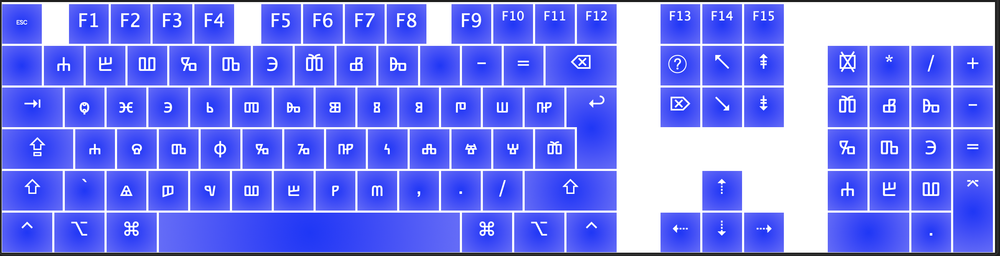

# Glagoljica za macOS

Glagoljicna tastatura/tipkovnica za macOS (UTF-8)

Brojevi su od 1-9 (1 = Ⰰ , 2 = Ⰱ ...) bez nule. 

### Instalacija 

`git clone https://github.com/xologram/glagoljica.git`

`cd glagoljica`

`./install` 

Skripta ce instalirati glagoljicnu tastaturu za korisnika koji je pokrenuo skriptu. Ukoliko zelite da instalirate glagoljicu za sve korisnike ukucajte:

`sudo cp Glagoljica.{icns,keylayout} /Library/Keyboard\ Layouts`

Predlozi su dobrodosli.

Ⱆⰶⰻⰲⰰⰼⱅⰵ!
